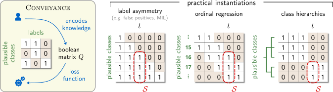

# Conveyance: A Versatile Framework for Learning in Structured Class Spaces

[](https://arxiv.org/abs/2605.28420) Here is our paper: [Conveyance: A Versatile Framework for Learning in Structured Class Spaces](https://arxiv.org/abs/2605.28420v2)


Standard loss functions like cross-entropy treat all classes symmetrically — ignoring any structural relationships between them. This is a fundamental limitation when class spaces carry meaningful structure (e.g., hierarchies, ordinal relationships) or when label noise is structured rather than random.

**Conveyance** is a classification loss that encodes graph-like relations between classes directly, without requiring joint distribution modeling or manual utility matrix design. It maximizes two separate margins over distinct class partitions while preserving formal properties such as monotonicity and partial convexity.

<p align="center">
  
  <br>
  <em>Figure 1: Overview of Conveyance for learning in structured class spaces. Problem knowledge is encoded through a boolean matrix Q connecting each label to a set of plausible classes. The approach covers label asymmetry, ordinal regression, and hierarchical classification (left to right).</em>
</p>

## Loss Function

$$
\ell(p,t) = \log \left(1 + \alpha \cdot \frac{1-p_t}{p_t} + \beta \cdot \frac{1-p_\mathcal{S}}{p_\mathcal{S}} \right)
$$

where $p_t$ is the predicted probability of the true class, $p_\mathcal{S}$ is the predicted probability of the set of plausible classes $\mathcal{S}$, and $\alpha, \beta$ control the contribution of each margin term.

## Repository Structure

This repository provides code for two experimental settings from the paper:

```
Conveyance/
├── Annotation-Bias/   # Robustness under structured annotation bias (CIFAR-10/100)
└── MIL/               # Multiple instance learning (MIL benchmarks + Camelyon16)
```

The core loss implementation is in [`Annotation-Bias/loss.py`](Annotation-Bias/loss.py).

## Experiments

### Annotation Bias (`Annotation-Bias/`)

Evaluates Conveyance against noise-robust baselines under structured label noise on CIFAR-10 and CIFAR-100. See [`Annotation-Bias/README.md`](Annotation-Bias/README.md) for setup and usage.

### Multiple Instance Learning (`MIL/`)

Applies Conveyance as an instance-level loss within an attention-based MIL framework (ABMIL). Supports classic MIL benchmarks (Musk1/2, Fox, Tiger, Elephant) and Camelyon16 whole-slide images. See [`MIL/README.md`](MIL/README.md) for setup and usage.

## Citation

If you use this code, please cite our paper:

```bibtex
@article{conveyance2026,
  title   = {Conveyance: A Versatile Framework for Learning in Structured Class Spaces},
  year    = {2026},
  url     = {https://arxiv.org/abs/2605.28420}
}
```
